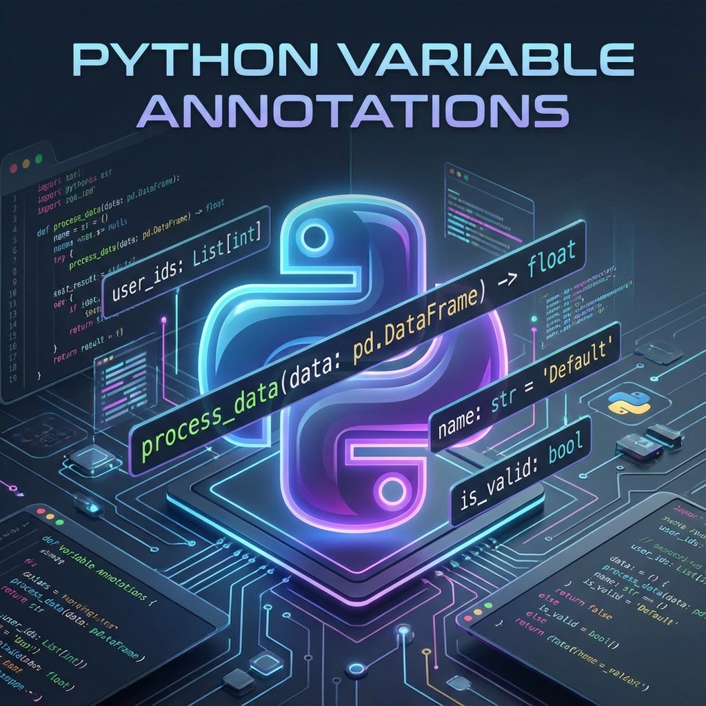

# Python - Variable Annotations

<div align="right">
  <a href="README.md">🇬🇧 English</a> | <a href="README.fr.md">🇫🇷 Français</a>
</div>



## Description

This project explores type annotations in Python 3, a powerful feature that allows you to specify the expected types of variables, function parameters, and return values. Through practical exercises, you will learn how to write more maintainable and self-documenting code, understand duck typing principles, and validate your code using static type checkers like mypy.

Type annotations improve code readability, help catch bugs early during development, and provide better IDE support with autocomplete and type checking. This project will give you hands-on experience with Python's `typing` module and teach you best practices for type hinting in modern Python applications.

## Learning Objectives

At the end of this project, you should be able to explain without help:

### General Concepts
- Type annotations in Python 3
- How you can use type annotations to specify function signatures and variable types
- Duck typing
- How to validate your code with mypy
- The difference between type hints and runtime type checking
- How to use the `typing` module for complex type annotations
- Best practices for type hinting in Python

## Resources

- [Python 3 typing documentation](https://docs.python.org/3/library/typing.html)
- [MyPy cheat sheet](https://mypy.readthedocs.io/en/stable/cheat_sheet_py3.html)
- [Type hints cheat sheet (Python 3)](https://mypy.readthedocs.io/en/stable/cheat_sheet_py3.html)
- [PEP 484 -- Type Hints](https://www.python.org/dev/peps/pep-0484/)
- [Real Python: Python Type Checking](https://realpython.com/python-type-checking/)

## Requirements

### General
- Allowed editors: `vi`, `vim`, `emacs`
- All your files will be interpreted/compiled on Ubuntu 20.04 LTS using `python3` (version 3.9)
- All your files should end with a new line
- The first line of all your files should be exactly `#!/usr/bin/env python3`
- A `README.md` file, at the root of the folder of the project, is mandatory
- Your code should use the `pycodestyle` style (version 2.5.)
- All your files must be executable
- The length of your files will be tested using `wc`
- All your modules should have a documentation (`python3 -c 'print(__import__("my_module").__doc__)'`)
- All your classes should have a documentation (`python3 -c 'print(__import__("my_module").MyClass.__doc__)'`)
- All your functions (inside and outside a class) should have a documentation (`python3 -c 'print(__import__("my_module").my_function.__doc__)'` and `python3 -c 'print(__import__("my_module").MyClass.my_function.__doc__)'`)
- A documentation is not a simple word, it's a real sentence explaining what's the purpose of the module, class or method (the length of it will be verified)

## Project Structure

```
python_variable_annotations/
├── 0-add.py                    # Basic type annotations - addition
├── 1-concat.py                 # Basic type annotations - concatenation
├── 2-floor.py                  # Basic type annotations - floor
├── 3-to_str.py                 # Basic type annotations - to string
├── 4-define_variables.py       # Variable annotations
├── 5-sum_list.py               # Complex types - list of floats
├── 6-sum_mixed_list.py         # Complex types - mixed list
├── 7-to_kv.py                  # Complex types - tuple
├── 8-make_multiplier.py        # Complex types - functions
├── 9-element_length.py         # Duck typing - iterable object
└── README.md
```

## Tasks Overview

### 0. Basic annotations - add
**File:** `0-add.py`

Write a type-annotated function `add` that takes a float `a` and a float `b` as arguments and returns their sum as a float.

**Example:**
```python
#!/usr/bin/env python3
add = __import__('0-add').add

print(add(1.11, 2.22) == 1.11 + 2.22)
print(add.__annotations__)
```

**Output:**
```
True
{'a': <class 'float'>, 'b': <class 'float'>, 'return': <class 'float'>}
```

### 1. Basic annotations - concat
**File:** `1-concat.py`

Write a type-annotated function `concat` that takes a string `str1` and a string `str2` as arguments and returns a concatenated string.

**Example:**
```python
#!/usr/bin/env python3
concat = __import__('1-concat').concat

str1 = "egg"
str2 = "shell"

print(concat(str1, str2) == "{}{}".format(str1, str2))
print(concat.__annotations__)
```

**Output:**
```
True
{'str1': <class 'str'>, 'str2': <class 'str'>, 'return': <class 'str'>}
```

### 2. Basic annotations - floor
**File:** `2-floor.py`

Write a type-annotated function `floor` which takes a float `n` as argument and returns the floor of the float.

**Example:**
```python
#!/usr/bin/env python3

import math

floor = __import__('2-floor').floor

ans = floor(3.14)

print(ans == math.floor(3.14))
print(floor.__annotations__)
print("floor(3.14) returns {}, which is a {}".format(ans, type(ans)))
```

**Output:**
```
True
{'n': <class 'float'>, 'return': <class 'int'>}
floor(3.14) returns 3, which is a <class 'int'>
```

### 3. Basic annotations - to string
**File:** `3-to_str.py`

Write a type-annotated function `to_str` that takes a float `n` as argument and returns the string representation of the float.

**Example:**
```python
#!/usr/bin/env python3
to_str = __import__('3-to_str').to_str

pi_str = to_str(3.14)
print(pi_str == str(3.14))
print(to_str.__annotations__)
print("to_str(3.14) returns {} which is a {}".format(pi_str, type(pi_str)))
```

**Output:**
```
True
{'n': <class 'float'>, 'return': <class 'str'>}
to_str(3.14) returns 3.14, which is a <class 'str'>
```

### 4. Define variables
**File:** `4-define_variables.py`

Define and annotate the following variables with the specified values:

- `a`, an integer with a value of 1
- `pi`, a float with a value of 3.14
- `i_understand_annotations`, a boolean with a value of True
- `school`, a string with a value of "Holberton"

**Example:**
```python
#!/usr/bin/env python3

a = __import__('4-define_variables').a
pi = __import__('4-define_variables').pi
i_understand_annotations = __import__('4-define_variables').i_understand_annotations
school = __import__('4-define_variables').school

print("a is a {} with a value of {}".format(type(a), a))
print("pi is a {} with a value of {}".format(type(pi), pi))
print("i_understand_annotations is a {} with a value of {}".format(type(i_understand_annotations), i_understand_annotations))
print("school is a {} with a value of {}".format(type(school), school))
```

**Output:**
```
a is a <class 'int'> with a value of 1
pi is a <class 'float'> with a value of 3.14
i_understand_annotations is a <class 'bool'> with a value of True
school is a <class 'str'> with a value of Holberton
```

### 5. Complex types - list of floats
**File:** `5-sum_list.py`

Write a type-annotated function `sum_list` which takes a list `input_list` of floats as argument and returns their sum as a float.

**Example:**
```python
#!/usr/bin/env python3

sum_list = __import__('5-sum_list').sum_list

floats = [3.14, 1.11, 2.22]
floats_sum = sum_list(floats)
print(floats_sum == sum(floats))
print(sum_list.__annotations__)
print("sum_list(floats) returns {} which is a {}".format(floats_sum, type(floats_sum)))
```

**Output:**
```
True
{'input_list': typing.List[float], 'return': <class 'float'>}
sum_list(floats) returns 6.470000000000001 which is a <class 'float'>
```

### 6. Complex types - mixed list
**File:** `6-sum_mixed_list.py`

Write a type-annotated function `sum_mixed_list` which takes a list `mxd_lst` of integers and floats and returns their sum as a float.

**Example:**
```python
#!/usr/bin/env python3

sum_mixed_list = __import__('6-sum_mixed_list').sum_mixed_list

print(sum_mixed_list.__annotations__)
mixed = [5, 4, 3.14, 666, 0.99]
ans = sum_mixed_list(mixed)
print(ans == sum(mixed))
print("sum_mixed_list(mixed) returns {} which is a {}".format(ans, type(ans)))
```

**Output:**
```
{'mxd_lst': typing.List[typing.Union[int, float]], 'return': <class 'float'>}
True
sum_mixed_list(mixed) returns 679.13 which is a <class 'float'>
```

### 7. Complex types - string and int/float to tuple
**File:** `7-to_kv.py`

Write a type-annotated function `to_kv` that takes a string `k` and an int OR float `v` as arguments and returns a tuple. The first element of the tuple is the string `k`. The second element is the square of the int/float `v` and should be annotated as a float.

**Example:**
```python
#!/usr/bin/env python3

to_kv = __import__('7-to_kv').to_kv

print(to_kv.__annotations__)
print(to_kv("eggs", 3))
print(to_kv("school", 0.02))
```

**Output:**
```
{'k': <class 'str'>, 'v': typing.Union[int, float], 'return': typing.Tuple[str, float]}
('eggs', 9)
('school', 0.0004)
```

### 8. Complex types - functions
**File:** `8-make_multiplier.py`

Write a type-annotated function `make_multiplier` that takes a float `multiplier` as argument and returns a function that multiplies a float by `multiplier`.

**Example:**
```python
#!/usr/bin/env python3

make_multiplier = __import__('8-make_multiplier').make_multiplier
print(make_multiplier.__annotations__)
fun = make_multiplier(2.22)
print("{}".format(fun(2.22)))
```

**Output:**
```
{'multiplier': <class 'float'>, 'return': typing.Callable[[float], float]}
4.928400000000001
```

### 9. Let's duck type an iterable object
**File:** `9-element_length.py`

Annotate the below function's parameters and return values with the appropriate types:

```python
def element_length(lst):
    return [(i, len(i)) for i in lst]
```

**Example:**
```python
#!/usr/bin/env python3

element_length =  __import__('9-element_length').element_length

print(element_length.__annotations__)
```

**Output:**
```
{'lst': typing.Iterable[typing.Sequence], 'return': typing.List[typing.Tuple[typing.Sequence, int]]}
```

## Key Concepts Explained

### Type Annotations

Type annotations are a way to explicitly declare the expected types of variables, parameters, and return values in Python:

```python
def greet(name: str) -> str:
    return f"Hello, {name}!"

age: int = 25
```

### The typing Module

The `typing` module provides support for complex type hints:

```python
from typing import List, Dict, Tuple, Union, Optional, Callable

# List of integers
numbers: List[int] = [1, 2, 3]

# Dictionary with string keys and integer values
scores: Dict[str, int] = {"Alice": 95, "Bob": 87}

# Tuple with specific types
point: Tuple[float, float] = (3.14, 2.71)

# Union type (can be one of several types)
id_value: Union[int, str] = "ABC123"

# Optional (can be None)
middle_name: Optional[str] = None

# Function type
callback: Callable[[int, int], int] = lambda x, y: x + y
```

### Duck Typing

Duck typing is a concept where the type or class of an object is less important than the methods it defines. In Python: "If it walks like a duck and quacks like a duck, then it must be a duck."

```python
from typing import Iterable

def process_items(items: Iterable[str]) -> None:
    for item in items:
        print(item)

# Works with different iterable types
process_items(["a", "b", "c"])      # list
process_items(("x", "y", "z"))      # tuple
process_items({"key1", "key2"})     # set
```

### Validating with mypy

`mypy` is a static type checker for Python. Install it with:

```bash
pip install mypy
```

Check your code:

```bash
mypy your_file.py
```

**Example:**

```python
def add_numbers(a: int, b: int) -> int:
    return a + b

result: int = add_numbers(5, 10)      # ✓ OK
wrong: int = add_numbers(5, "10")     # ✗ Error: Argument 2 has incompatible type
```

### Common Type Annotations

**Basic types:**
```python
x: int = 42
y: float = 3.14
name: str = "Alice"
is_valid: bool = True
```

**Collections:**
```python
from typing import List, Dict, Set, Tuple

numbers: List[int] = [1, 2, 3]
mapping: Dict[str, int] = {"a": 1, "b": 2}
unique: Set[str] = {"apple", "banana"}
coordinates: Tuple[float, float] = (10.5, 20.3)
```

**Union and Optional:**
```python
from typing import Union, Optional

# Can be int or str
id_value: Union[int, str] = 123

# Can be str or None
name: Optional[str] = None  # Same as Union[str, None]
```

**Callable:**
```python
from typing import Callable

# Function that takes two ints and returns an int
operation: Callable[[int, int], int] = lambda x, y: x + y
```

## Usage

### Running Your Scripts

```bash
# Make the file executable
chmod +x 0-add.py

# Run with test file
./0-main.py
```

### Type Checking with mypy

```bash
# Check a single file
mypy 0-add.py

# Check all Python files
mypy *.py

# Strict mode
mypy --strict 0-add.py
```

### Viewing Annotations

```python
# In Python interpreter
>>> from typing import get_type_hints
>>> import 0-add
>>> get_type_hints(0-add.add)
{'a': <class 'float'>, 'b': <class 'float'>, 'return': <class 'float'>}

# Using __annotations__
>>> 0-add.add.__annotations__
{'a': <class 'float'>, 'b': <class 'float'>, 'return': <class 'float'>}
```

## Tips for Success

1. **Start simple** - Begin with basic type annotations before moving to complex types
2. **Use the typing module** - Import necessary types from `typing` for complex annotations
3. **Be consistent** - Annotate all function parameters and return values
4. **Test with mypy** - Regularly validate your code with mypy to catch type errors
5. **Read documentation** - The official Python typing documentation is your best friend
6. **Consider readability** - Type hints should make code more readable, not less

## Common Pitfalls

- Forgetting to import types from the `typing` module
- Using lowercase `list`, `dict`, `tuple` instead of `List`, `Dict`, `Tuple` from typing (in Python < 3.9)
- Not understanding the difference between `Union[int, str]` and `Optional[int]`
- Over-annotating - not every variable needs a type hint
- Confusing type hints with runtime type checking (Python doesn't enforce types at runtime)

## Technologies Used

- **Python 3.9**: Main programming language with enhanced type hinting support
- **mypy**: Static type checker for Python
- **typing module**: Standard library module for type hints

## Best Practices

- Always annotate function signatures (parameters and return values)
- Use descriptive variable names with appropriate type hints
- Leverage `Union` for flexibility when a parameter can accept multiple types
- Use `Optional` for parameters that can be `None`
- Document complex type hints with comments when necessary
- Run mypy regularly during development to catch type errors early

## Author

[rpokman](https://github.com/rpokman)

## License

This project is intended for educational purposes as part of the Holberton School program.
